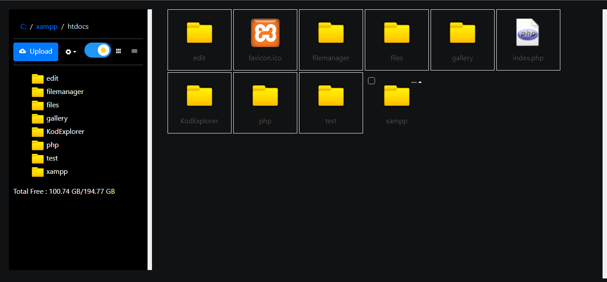

## SIMPLE PHP FILE MANAGER
 hey folks this is a very simple easy to use php based 
 file manager.

### Config 
 edit index.php 
 edit below lines with your web url and server path
 

```php
$web_url = "https://example.com";  //  line 61
// Root path for file manager 
// use absolute path of directory i.e: '/var/www/folder' or $_SERVER['DOCUMENT_ROOT'].'/folder'
$root_path = $_SERVER['DOCUMENT_ROOT']; // line 64 
```


### TODO
- [x]  Upload file (upto 4gb)
- [x]  Edit Text Files
- [x]  create new Folders
- [x]  create new Files
- [x]  in-built text editor
- [x]  Delete Folder/Files
- [x]  Dark mode
- [x]  File/Folders Icon
- [x]  File Download
- [x]  Grid Layout
- [ ]  List Layout
- [x]  Rename Folder/file
- [x]  Copy file
- [x]  Copy Folder
- [ ]  move Folder/file
- [ ]  PDF Viewer
- [ ]  PPT VIEWER
- [x]  AUTH / READONLY MODE (only auth mode added)